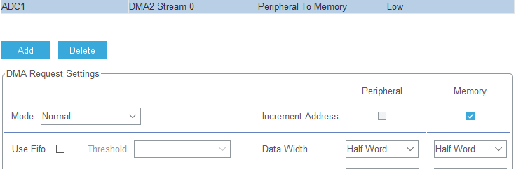
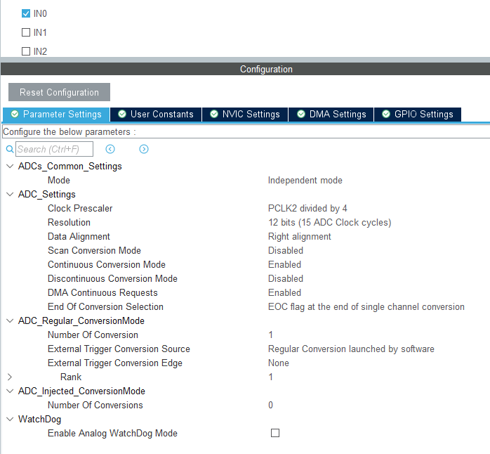
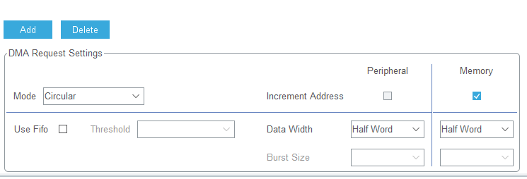

# DMA专题实践

## DMA正常模式

ADC_CR2 寄存器为16位，所以选择Half word,

如果选择byte,则DAM只读CR2的低八位也就是说最大值只有255了

## DMA循环模式

ADC配置不变

代码只需要启动一次DMA即可

## DMA双缓冲模式

若使用硬件方案也不需要DAM可配置成Circular或Normal

若使用软件方案则DMA一定要配置为Circular
